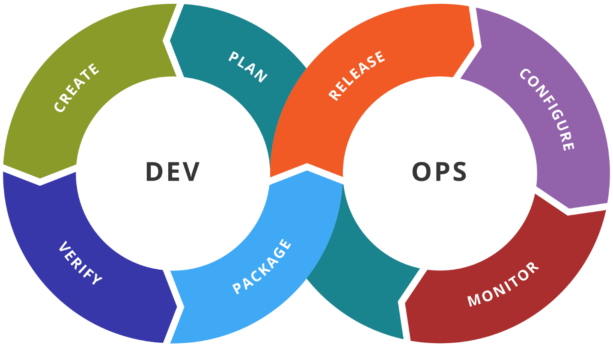
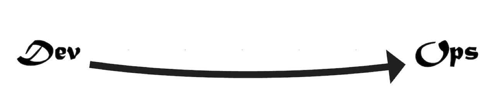
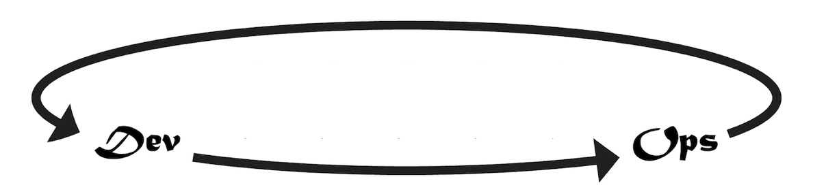
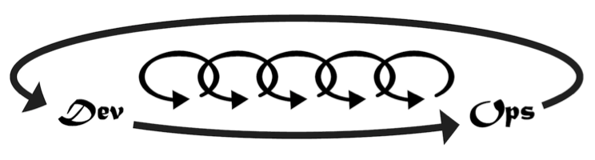

Chapter 1 – Introduction
========================

The purpose of this book is to equip .Net development teams with a complete
roadmap to a high-performing DevOps process using Microsoft technologies. This
book is not about any one product or tool. It is not about one particular
practice or method. This book is about bringing all the tools and frameworks
Microsoft and the industry has to offer into the fold. This book is about
applying the relevant practices and methods in an effective way in order to
achieve a software delivery process that is second-to-none. If you lead a
software team and want to deliver and operate software like companies you’ve
only read about, read on. My goal for you is to enable your team to deliver
twice as much as before. If you are just starting your development career, my
goal for you is to help you gain 5-10 years of experience by the application of
this text.

Principles
----------

I will start with principles, because any technical work that we do must be
guided by principles if others are to align with our work. Without guiding
principles, a team cannot become a team. The team will have no culture, and each
team member will be tugging in different directions.

### DevOps Principles

In his popular book, [The Phoenix Project: A Novel About IT, DevOps, and Helping
...](https://www.amazon.com/Phoenix-Project-DevOps-Helping-Business-ebook/dp/B00AZRBLHO),
Gene Kim enumerates three guiding principles of DevOps. He names them “The Three
Ways”. They are:

1.  The First Way: Systems Thinking

2.  The Second Way: Amplify Feedback Loops

3.  The Third Way: Culture of Continual Experimentation and Learning

These are quite abstract, but they have complex implementations, and we will be
tackling how to implement each of these principles throughout this book

### The Challenge of Explosive Growth

By any measure, the number of professional developers has exploded over the last
decade, surpassing the growth rate of the previous decade. In Stack Overflow’s
2018 survey, we can see that over half of professional developers entered the
industry in the last five years.

*Over half of developers have five years of professional coding experience or
less – Stack Overflow*

If you have surpassed 20 years of development experience, you qualify at the top
5.2% of experience in the industry. We can see the inflection point between the
6-8 years and 3-5 years of experience. It’s unclear how the growth will continue
or if business demand will start to be saturated. Regardless of future growth,
we have a challenge in our industry created by this explosive growth in the
workforce.

Consider this analogy. You are opening a new auto mechanic shop.

*Figure :An auto mechanic shop must be set up in a way conducive to delivery
quality and speed.*

You purchase a fantastic location on a main road close to other centers of
business. You spare no expense building the shop. You contact a local mechanic
trade school and declare you wish to hire the top 7% of up-coming graduating
class. You have budgeted for whatever pay it takes to hire the best and the
brightest who have just been trained as new mechanics.

Along comes graduation day, and the next week, you are preparing to open for
business. You gather in front of the shop next to pallets of just-delivery tools
and shop equipment. You brief your new workforce expressing excitement saying,
“Let’s get the shop ready for opening. We start serving customers next week.”
Your staff’s excitement turns to fear with wide eyes. Your grand opening is a
disaster, and you wonder what you missed.

This manager hired staff who had been trained in how to fix and service
automobiles. They were smart, skillful and motivated. They were trained in an
environment that was expertly configured. Alas, the curriculum did not include
how to set up a new environment for themselves.

Unfortunately, more than a few team leaders and managers have experienced a
similar situation. These teams have developers who know how to apply their
training and practice. But in every trade that builds something, the jobsite, or
environment, has a profound effect on the effectiveness of the team. This book
will equip you to build a highly effective DevOps environment for your team.

DevOps Methodology
------------------

In this industries lies much confusion about DevOps. Having only been named as
such in 2010, DevOps has been commercialized and marketed. We will cover DevOps
more in Chapter 3. For now, we’ll discuss the common glyphs and overviews.
Wikipedia shows this process when you search for DevOps.

*Figure : Illustration showing stages in a DevOps toolchain*

Wikipedia relates that DevOps is a process with these stages, moving through Dev
and Ops teams

If you read the books that introduced DevOps to the world, you’ll see that this
definition illustrates some of The First Way and touches on The Second Way a
bit.

### The First Way: Systems Thinking

The DevOps methodology is based on the principles known as The Three Ways. The
First Way is Systems Thinking.

*TODO: recreate graphic - The First Way is Systems Thinking*

There is a lot of thought packed into this first principle of DevOps. It
encompasses the ability to create a smooth, predictable flow of working software
from the imagination of the developers to the active use of the customer. In our
world, regardless of job description or job title, if you are involved in
building or changing the software, you are on the side of Dev. If you are
someone who uses or consumes or depends on the software, then you are on the
side of Ops. Other definitions of DevOps that don’t actually include the user
are at great risk.

### The Second Way: Amplify Feedback Loops

In this principle, we create an environment where those using our software –
those operating their business or departments with our software – provide
continual feedback to those developing and changing the software.

*Those operating their departments using our software provide continual feedback
to those changing the software.*

We can put ourselves in the right DevOps mindset by translating the keywords as
follows:

-   Dev: Includes anyone who works to build, change, improve the software or
    system

-   Ops: Includes anyone who relies on the software to operate their business or
    department

If our company has a department known as IT Operations, or Support, or Data
Center Operations, it’s important not to confuse these groups as our customer.
They don’t use the software. They are merely part of our development capability.
The capability to deliver valuable software to our customer so that our customer
can operate the software in order to experience its value.

### The Third Way: Culture of Continual Experimentation and Learning

If the first two Ways were about completing a software release cycle in a
streamlined and effective way, The Third Way is about making that cycle faster.

*The Third Way introduces smaller cycles within the cycle*

Companies such as Netflix showed us that software can be released not only daily
but many times per day with no downtime and no defects. The Third Way causes us
to think with that end in mind, solving any challenges that would prevent us
from this ability. Even if the customer doesn’t want software releases at that
cadence, this way of thinking causes us to gain this capability so that we are
ready on a moments notice to release the software as it stands, always stable,
always working, always bug-free. This way of thinking also encourages us to stop
thinking about software releases as a big ceremony. We will see in the coming
chapters how to equip our teams with the ability to release changes big and
small. We will see that the same process needed for small changes is effective
for large changes when every small change has made a trip down the DevOps
pipeline.

In Practice
-----------

Given all the above, what do we actually do, in practice? In order to answer
that, lets take a look at the different types of software we are working on and
where we want it to work.

### Application Runtime Architectures

You are building software with Visual Studio. Regardless of some libraries or
frameworks you might choose, you have a finite set of runtime architectures to
choose from. Popular today is a web architecture which consists of a ASP.NET web
application and a SQL Server database. Or you might have a desktop WPF
application communicating to ASP.NET Web API services that then use a SQL Server
database. If you have an iPhone app, that might connect to your Web API
services. Regardless of the combination of runtimes you take advantage of, the
Microsoft platform has a finite set of choices, and the Azure cloud has a
handful of ways to run each.

| **Application architecture**          | **Production Runtime**           |
|---------------------------------------|----------------------------------|
| ASP.NET MVC                           | IIS/Azure App Service, etc.      |
| ASP.NET Web Api                       | IIS/Azure App Service, etc.      |
| SignalR                               | IIS/Azure App Service, etc.      |
| Razor Pages                           | IIS/Azure App Service, etc.      |
| SPA(Razor Components, Angular, React) | IIS/Azure App Service, etc.      |
| Windows Service                       | VM, Webjob, Azure Function, etc. |
| Scheduled EXE                         | VM, Webjob, Azure Function, etc. |
| SQL Database                          | Azure SQL, Cosmos DB             |

A small illustration of Azure runtimes covering the breadth of application
architectures.

While this table is nowhere near being complete, we can see that through web
applications, offline jobs, and a relational database, we cover a high
percentage of applications out in the wild. WPF, Winforms, and native iOS and
Android applications are also supported by a small number of options. With each
of these application types, we can choose a full range of runtime options from
Infrastructure as a Service (IaaS) to Platform as a Service (PaaS).

The architectural point to consider when designing a DevOps capability is to
realize that while implementing The First Way, we need not support an unique
configuration for every team or application. Once we understand how to deliver a
web application of some form with a SQL database out to Azure, how many of our
applications are now covered? I would venture to guess for each of you dear
readers, that a high number of your applications use those architectural
components. We then add a capability for off-line jobs such as Windows Services
and Scheduled Tasks, and we cover a good part of the gap. Once we have these
application types covered, you will see how much smaller of a leap it is to then
cover your native mobile apps, and Windows deskop apps as well.

### The Necessary Tools

In order to set up a professional DevOps environment targeting Azure, you’ll
need to have a few key tools to get started.

-   An Azure subscription.

-   Visual Studio (2019 or VSCode)

-   An Azure DevOps Services org

These tools are just the starting point, and throughout this book, we’ll
integrate more tools, libraries, frameworks from Microsoft, other vendors, as
well as open-source repositories. Remember, DevOps is about a way of thinking
that leads to an outcome of shorter lead times, shorter cycle times, and fewer
disruptions. Throughout this book, we’ll put all these pieces together
one-by-one.

If you are just getting started with Azure or Azure DevOps Services, read on to
Chapter 2. It will quickly introduce some basic capabilities in an interactive
way that doesn’t yet require you to write any scripting. But don’t stop there.
The steps shown in Chapter 2 are only to introduce first-time developers. These
techniques are not meant for long-term maintainability. For the professional way
to set up your “shop”, move to Chapter 3 and beyond where we will go through
each area in detail.
