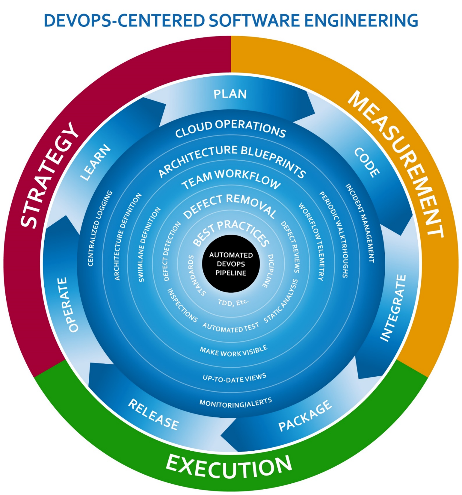
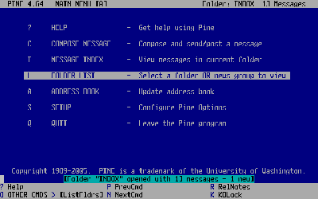
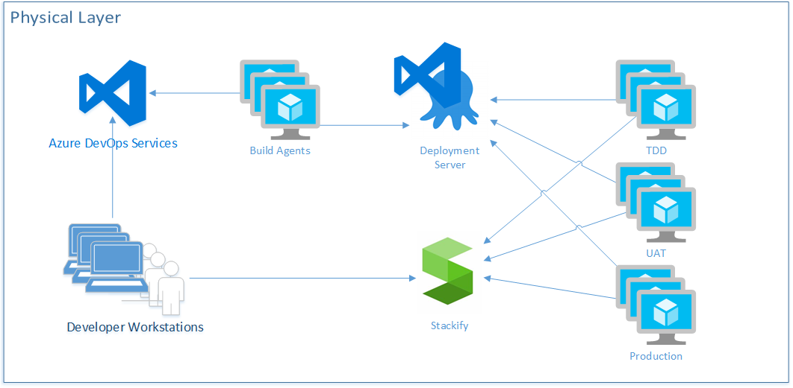
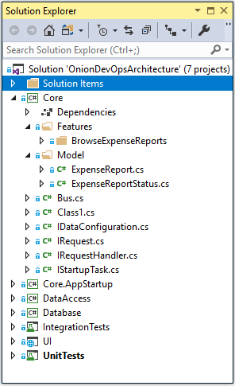
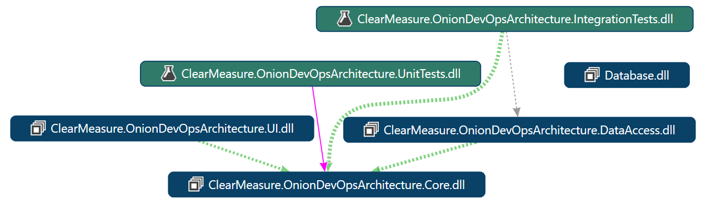

The Professional-Grade DevOps Environment
=========================================

As we equip our team with a professional-grade environment, we need a model by
which we can know what we are missing. This model is a depiction of a complete
environment set up for DevOps success. The name for this model is Onion DevOps
Architecture.

You can see that the automated DevOps pipeline is at the center of the onion –
the center of the model. The layers surrounding it are successive capabilities
with which the team is equipped. Each capability has a strategy, method of
execution and method of measurement. Once equipped with all the capabilities,
the process happens in very short cycles, and is expected to accelerate with
maturity. We will dive deeper into Onion DevOps Architecture later in this book.
To continue defining the professional-grade DevOps environment, it’s interesting
to reflect on the current state of DevOps in the industry.

The State of DevOps
-------------------

Several organizations are performing ongoing research into the advancement of
DevOps methods across the industry. Puppet and DORA are two that stand out.
Microsoft has sponsored the DORA State of DevOps Report. Sam Guckenheimer is the
Product Owner for all Azure DevOps products at Microsoft and contributed to the
report. He also spoke about that on his recent interview with the Azure DevOps
Podcast, which can be found at
<http://azuredevopspodcast.clear-measure.com/sam-guckenheimer-on-testing-data-collection-and-the-state-of-devops-report-episode-003>.

A key finding of DORA’s State of DevOps report was that elite performers take
full advantage of automation. From builds to testing to deployments and even
security configuration changes, elite performers have a seven times lower change
failure rate and over 2,000 times faster time to recover from incidents.

Other key texts that have led the industry’s definition of DevOps are a series
of books, all including Jez Humble. The progression in which you should read
them is:

-   “The Phoenix Project: A Novel about IT, DevOps, and Helping Your Business
    Win”, by Kim, Spafford, and Behr

-   “Continuous Delivery: Reliable Software Releases through Build, Test, and
    Deployment Automation”, by Farley and Humble

-   “The DevOps Handbook: How to Create World-Class Agility, Reliability, and
    Security in Technology Organizations,” by Kim, Humble, and Debois

If you are just getting into DevOps, don’t be discouraged. The industry is still
figuring out what it is too, but there are now plenty of success stories to
learn from.

### Removing the Ambiguity from DevOps

In the community of large enterprise software organizations, many define DevOps
as development and operations coming together and working together from
development through operations. This is likely the case in many organizations,
but I want to propose what DevOps will likely be as you look back on this era
twenty years from now from a time when your worldview isn’t colored by the
problems of today.

In the 1950s there were no operating systems. Therefore, there was no
opportunity for multiple programs to run at the same time on a computer. There
was no opportunity for one programmer to have a program that interfered with the
program of another. There was no need for this notion of Operations. The human
who wrote the program also loaded the program. That person also ran the program
and evaluated its output.

Fast forward to the era of the terminal mainframe server. In this era, a
programmer could load a program, and it had the potential of causing problems
for the other users of the mainframe. In this era, it became someone’s job to
keep the mainframe operating for the growing pool of mainframe users. Even if
you have never programmed for a mainframe, you might remember using Pine for
email. This was popular at universities in the 1990s. If this predates you, you
can see it in **Figure 8**.

**Figure 8:** Pine was a popular Unix mainframe email client in the 1990s.
(Photo credit: Wikipedia
<https://upload.wikimedia.org/wikipedia/en/c/ce/PineScreenShot.png>)

I believe that the DevOps movement is the correction of a software culture
problem that began with the mainframe era. Because multi-user computers, soon to
be called servers, became relied upon by an increasing number of people,
companies had to ensure that they remained operational. This transformed Data
Processing departments into IT departments. All of the IT assets need to run
smoothly. Groups that sought to change what was running on them became known as
developers, although I still call myself a computer programmer. Those who’re
responsible for stable operations of the software in production environments are
known as operations, filled with IT professionals, systems engineers, etc.

I believe you’re going to look back at the DevOps era and see that it’s not a
new thing you’re creating but an undoing of a big, costly mistake over two or
three decades. Instead of bringing together two departments so that they work
together, you’ll have eliminated these two distinct departments and will have
emerged with one type of persona: the software engineer. Smaller companies, by
the way, don’t identify with all the talk of development and operations working
together because they never made this split in the first place. There are
thousands upon thousands of software organizations that have always been
responsible for operating what they build. And with the Azure cloud, any
infrastructure operation becomes like electricity and telephone service, which
companies have always relied on outside parties to provide. .

Microsoft has already reorganized their Azure DevOps department in this fashion.
There is no notion of two departments working together. They eliminated the
divide by making one department staffed with two roles:

-   Program manager

-   Engineer

I believe this type of consolidation will happen all across the industry.
Although there’s always room for specialists in very narrow disciplines,
software organizations will require the computer programmer to be able to
perform all of the tasks necessary to deliver something they envisioned as it’s
built and operated.

A Professional-Grade DevOps Vision
----------------------------------

When you look at your own organization, you’re probably in the camp where you
want better quality and better speed. Your form of quality may be fewer bugs. It
may be fewer problems in production. It may be more uptime or better handling of
user load spikes. When you think of speed, you may be thinking about developing
new features. But business executives may be thinking about reducing the lead
time between when they fund a strategic initiative and when they’re able to
launch the software to support it. Regardless of the specific issues, it seems
to always come down to quality and speed. That’s when you need Capers Jones,
your industry’s leading software research statistician. In his recent book,
“Software Engineering Best Practices,” he demonstrates research that proves two
points:

-   Prioritizing speed causes shortcuts, which cause defects, which causes
    rework, which depletes speed. Therefore, prioritizing speed achieves neither
    speed nor quality.

-   Prioritizing quality reduces defects, which reduces rework, which directs
    all work capacity to the next feature. Therefore, prioritizing quality
    achieves speed as well.

You want to design a DevOps environment that squeezes out defects all along the
way. You can do this by automating the repetitive tasks and taking them away
from the human. Humans are not good at repetitive tasks. Computers are much
better at such things. But humans are very good at solving problems. Computers
are not good at “thinking outside the box.” The following capabilities are my
vision for a professional-grade DevOps environment:

-   Private build

-   Continuous integration build

-   Static code analysis

-   Release candidate versioning and packaging

-   Environment provisioning and configuration

-   Minimum of a three-tier deployment pipeline

-   Production diagnostics managed by development team

-   Insanely short cycle time through the previous steps

You don’t need an infrastructure like Netflix in order to accomplish this. In
fact, you can set this up with a skeleton architecture even before you’ve
written your first feature or screen for a new application. And you can retrofit
your current software into an environment like this as well. You want to keep in
mind the 80/20 rule and gain these new capabilities without adding to much scope
or trying to “boil the ocean” in your first iteration.

DevOps Architecture
-------------------

Let’s walk through the process that a DevOps environment manages. **Figure 9**
shows the logical structure of a DevOps environment. The full-sized image can be
downloaded from
<https://jeffreypalermo.com/2018/08/applying-41-architecture-blueprints-to-continuous-delivery/>.

**Figure 9:** The logical architecture layer of a DevOps environment

As I walk through this, I’ll take the stages one at a time. .

### Version Control

First, you must structure your Version Control System properly. In today’s
world, you’re using Git. Everything that belongs to the application should be
stored in source control. That’s the guiding principle. Database schema scripts
should be there. PowerShell scripts to configure environments should go there.
Documents that outline how to get started developing the application should go
there. Once you embrace that principle, you’ll step back and determine what
exceptions might apply to your situation. For instance, because Git doesn’t
handle differences in binary files very well, you may elect not to store lots
and lots of versions of very big Visio files. And if you move to .NET core,
where even the framework has become NuGet packages, you may elect to not store
your /packages folder like you might have with .NET Framework applications. But
the Git repository is the unit of versioning, so if you have to go back in time
to last month, you want to ensure that everything from last month is correct
when you pull it from the Git repository.

PULL QUOTE Everything that belongs to the application should be stored in source
control. That’s the guiding principle. Database schema scripts should be there.

### Private Build

The next step to configure properly is the private build. This should run
automated unit tests and component-level integration tests on a local
workstation. Only if this private build works properly and passes should you
commit and push your changes to the Git server. This private build is the basis
of the continuous integration build, so you want it to run in as short a period
of time as possible. No more than ten minutes is widely accepted industry
guidance. For new applications that are just getting started, 45 seconds is
normal and will show that you’re on the right track. This time should include
running two levels of automated test suites: your unit tests and component-level
integration tests.

### Continuous Integration Build

The continuous integration build is often abbreviated “CI Build.” This build
runs all the steps in the private build, for starters. It’s a separate server,
away from the nuances of configuration on your local developer workstation. It
runs on a server that has the team-determined configuration necessary for your
software application. If it breaks at this stage, a team member knows that they
need to back out their change and try again. Some teams have a standard to allow
for “I forgot to commit a file” build breaks. In this case, the developer has
one shot to commit again and fix the build. If this isn’t achieved immediately,
the commit is reverted so that the build works again. There’s no downside to
this because in Git, you never actually lose a commit. The developer who broke
the build can check out the commit they were last working on and try again once
the problem is fixed.

The continuous integration build is the first centralized quality gate. Capers
Jones’ research, referenced above, also concludes that three quality control
techniques can reliably elevate a team’s Defect Removal Efficiency (DRE) up to
95%. The three quality control techniques are testing, static code analysis, and
inspections. Inspections are covered later in a discussion of pull requests, but
static code analysis should be included in the continuous integration build.
Plenty of options exist, and these options integrate with Azure DevOps Services
very easily.

SIDEBAR

Static Code Analysis

Static code analysis is the technique of running an automated analyzer across
compiled code or code in source form in order to find defects. These defects
could be non-compliance to established standards. These defects could be
patterns known in the industry to result in run-time errors. Security defects
can also be found by analyzing known patterns of code or the usage of the
library versions with published vulnerabilities. Some of the more popular static
code analysis tools are:

Visual Studio Code Analysis
(<https://docs.microsoft.com/en-us/visualstudio/code-quality/code-analysis-for-managed-code-overview?view=vs-2017>

ReSharper command line tools
(<https://www.jetbrains.com/resharper/download/index.html#section=resharper-clt>)

Ndepend
(<https://marketplace.visualstudio.com/items?itemName=ndepend.ndependextension>)

SonarQube
([https://marketplace.visualstudio.com/items?itemName=SonarSyource.sonarqube](https://marketplace.visualstudio.com/items?itemName=SonarSource.sonarqube))

The CI build also runs as many automated tests as possible in ten minutes.
Frequently, all of the unit tests and component-level integration tests can be
included. These integration tests are not full-system tests but are tests and
that validate the functionality of one or two components of the application that
require code that calls outside of the .NET AppDomain. Examples are code that
relies on round trips to the database or code that pushes data onto a queue or
file system. This code that crosses an AppDomain or process boundary is orders
of magnitude slower than code that keeps only to the AppDomain memory space.
This type of test organization heavily impacts CI build times.

The CI build is also responsible for producing the versioned release candidate
package. Whether you package your application components in NuGet packages or
zip files, you need organized packaging. Each package needs to be named and
numbered with the build version. Because you’re only building this once,
regardless of how many environments you deploy to, it’s important that this
package contains everything necessary to provision, configure, and install the
application component on downstream environments. Note that this doesn’t include
credentials or environment-specific settings. Every assembly inside this package
must be stamped with the build number. Make sure you use the right command-line
arguments when you compile so that all produced assemblies receive the build
number. The following snippet shows an example of this with parameters
configured as PowerShell variables.

CODE

dotnet build \$syource_dir\\\$projectName.sln -nologo

\--no-restore -v \$verbosity -maxcpucount

\--configuration \$projectConfig --no-incremental

/p:Version=\$version

### Package Management

Because you’re producing release candidate packages, you need a good place to
store them. You could use a file system or the simple artifacts capability of
Azure DevOps, but using the rock-solid package management infrastructure of
NuGet is the best current method for storing these. This method offers the API
surface area for downstream deployments and other tools, like Octopus Deploy.

Azure DevOps Services offers a built-in NuGet server as Azure Artifacts. With
your MSDN or Visual Studio Enterprise subscription, you already have the license
configuration for this service, and I recommend that you use it. It allows you
to use the standard \*.nupkg (pronounced nup-keg) package format, which has a
place for the name and a version that can be read programmatically by other
tools. It also retains release candidates so they are always available for
deployment. And when you need to go back in time for a hotfix deployment or
reproduction of a customer issue, you always have every version.

### Test-Driven Development Environment (TDD Environment)

The first of the three types of environments in a DevOps pipeline is the TDD
environment. You might also call it the ATTD environment if you have adopted
Acceptance Test-Driven Development. This is the environment where no humans are
allowed. Once your pipeline deploys the latest release candidate, your suites of
automated full-systems tests are unleashed on this environment. Some examples of
full-system tests might be:

-   Web UI tests using Selenium

-   Long-running full-system tests that rely on queues

-   ADA accessibility tests

-   Load tests

-   Endurance tests

-   Security scanning tests

The TDD environment can be a single instance, or you can create parallel
instances in order to run multiple types of test suites at the same time. This
is a distinct type of environment, and builds are automatically deployed to this
environment type. It’s not meant for humans because it automatically destroys
and recreates itself for every successive build, including the SQL Server
database and other data stores. This type of environment gives us confidence
that you can recreate an environment for your application at any time you need
to. That confidence is a big boost when performing disaster recovery planning.

PULL QUOTE The TDD environment is a distinct type of environment, and builds are
automatically deployed to this environment type. It’s not meant for humans

### Manual Test Environment

This is an environment type, not a single environment. Organizations typically
have many of these. QA, UAT, and Staging are all common names for this
environment type, which exists for the manual verification of the release
candidate. You provision and deploy to this environment automatically, but you
rely on a human to check something and give a report that either the release
candidate has issues or that it passed the validations. This type of environment
is the first environment available for human testing, and if you need a Demo
environment, it would be of this type. It uses a full-size production-like set
of data. Note that it should not use production data because doing so likely
increases the risk of data breach by exposing sensitive data to an increased
pool of personnel. The size and complexity of the data should be similar in
scale to production. During deployments of this environment type, data is not
reloaded every time, and automated database schema migrations run against the
existing database and preserve the data. This configuration ensures that the
database deployment process will work against production when deployed there.
And because of the nature of this environment’s configuration, it can be
appropriate for running some non-functional test suites in the background. For
instance, it can be useful to run an ongoing set of load tests on this
environment as team members are doing their normal manual validation. This can
create an anecdotal experience to give the humans involved a sense of whether or
not the system feels sluggish from a perception point of view. Finally, this
environment type should be configured with similar scale specs as production,
including monitoring and alerting. Especially in Azure, it’s not quite
affordable to scale up the environment just like production because environments
can be turned off on a moment’s notice. The computing resources account for the
vast majority of Azure costs; data sets can be preserved for pennies even while
the rest of the environment is torn down.

### Production Environment

Everyone is familiar with this environment type. It’s the one that’s received
all the attention in the past. This environment uses the exact same deployment
steps as the manual environment type. Obviously, you preserve all data sets and
don’t create them from scratch. The configuration of monitoring alert thresholds
will have its own tuning, and alerts from this environment will flow through all
communication channels; previous environments wouldn’t have sent out “wake-up
call” alerts in the middle of the night if an application component went down.
And in this environment, you want to make sure that you’re not doing any new.
You don’t want to do anything for the first time on a release candidate. If your
software requires a zero-downtime deployment, the previous environment should
have also used this method so that nothing is tested for the first time in
production. If an off-line job is taken down and transactions need to queue up
for a while until that process is back up, a previous environment should include
that scenario so that your design for that process has been proven before it
runs on production. In short, the deployment to production should be completely
boring if all needed capabilities have been tested in upstream environments.
That’s the goal.

PULL QUOTE Deployment to production should be completely boring if all needed
capabilities have been tested in upstream environments.

### Production Monitoring and Diagnostics

Production monitoring and diagnostics is not an independent state but is a topic
that needs to apply to all environments. Monitoring and operating your software
in Azure isn’t just a single topic. There is a taxonomy of methods that you need
in order to prevent incidents. Recently, Eric Hexter made a presentation on this
topic to the Azure DevOps User Group, and that video recording can be found at
<https://youtu.be/6O-17phQMJo>. Eric goes through the different types of
diagnostics including metrics, centralized logs, error conditions, alerts, and
heartbeats.

Tools of the Professional DevOps Environment
--------------------------------------------

Now that you’ve covered the capabilities that need to be a part of a
professional DevOps environment, let’s discuss how to use what Microsoft and the
marketplace have to offer. **Figure 10** shows the physical(runtime) environment
view of this environment.

**Figure 10:** This view shows what runs where the pieces of DevOps
infrastructure run.

In **Figure 10**, you make a sample selection of marketplace tools that
complement Azure DevOps Services. The Visual Studio and Azure marketplaces offer
a tremendous array of capable products, and you’ll want to select and integrate
the ones that fit your software architecture. In this configuration, you see
that Azure DevOps Services will be what developers interact with by committing
code from their workstations, making changes to work items, and executing pull
requests. You are specifying that you’ll have your own virtual machines as build
agents in order to provide more speed to the build process. You’ll also use the
Release Hub in Azure DevOps in conjunction with Octopus Deploy as your
deployment capability. Although Azure Pipeline is increasing its breadth of
support for all kinds of deployment architectures, Octopus Deploy was the
original deployment server for the .NET ecosystem, and its support is
unparalleled in the industry at the moment. You show that you have deployment
agents at the servers that represent each of your environments, and that they
call back to the deployment server rather than having the deployment server call
through the firewall directly into each server. Then you have specified Stackify
as an APM tool collecting logs, telemetry, and metrics from each environment.
Your developers can then access this information. Obviously, this architecture
shows an environment very light on PaaS. Although new applications can easily
make heavy use of PaaS, and we encourage it, most of you readers also have an
existing system that would require a great deal of work in order to shift the
architecture to free itself from VM-based environments. Professional DevOps is
not only for greenfield applications. It can be applied to all applications.

### Azure DevOps Services

On September 10, 2018, Microsoft pulled the trigger on a major release that
included the segmentation of its popular product, Visual Studio Team Services
(VSTS). It broke the product into five products and has named this family of
products Azure DevOps. The new five products are:

-   **Azure Pipelines:** Supports continuous integration builds and automated
    deployments

-   **Azure Repos:** Provides source code hosting for a TFVC repository and any
    number of Git repositories

-   **Azure Boards:** Organizes work and project scope using a combination of
    backlogs, Kanban boards, and dashboards

-   **Azure Test Plans:** Integrates tightly with Azure Boards and Azure
    Pipelines by providing support for automated and manual full-system testing,
    along with some very interesting stakeholder feedback tools

-   **Azure Artifacts:** Provides the capability to provision your team’s own
    package feeds using NuGet, Maven, or npm

The independent services that has been receiving lightning-fast adoption since
early September is Azure Pipelines. Especially with the acquisition of GitHub,
the experience to set up a build for a code base stored in GitHub is simple and
quick.

### Azure Subscription

In order to set up your DevOps environment, you need an Azure subscription. Even
if all your servers are in a local data center, Azure DevOps Services runs
connected to your Azure subscription, even if only for billing and Azure Active
Directory. Using your Visual Studio Enterprise subscription, you also have a
monthly budget for trying out Azure features, so you might as well use it.

The Azure subscription is a significant boundary. If you are putting your
application in Azure, you really want to think about the architecture of your
subscriptions and your resource groups. There will never be only one. In fact,
even if you attempt to put all your applications in a single subscription,
you’ll quickly find out that the subscription wasn’t designed to be used that
way. The subscription is a strong boundary of security, billing, and environment
segmentation. Some rules of thumb when it comes to deciding on when to create a
new subscription or resource group are:

-   A subscription that houses the production environment of a system should not
    also house an environment with lesser security controls. The subscription
    will only be as secure as its least secure resource group and access control
    list.

-   Pre-production environments may be grouped together in a single subscription
    but placed in separate resource groups.

-   A single team may own and use many Azure subscriptions, but a single
    subscription should not be used by multiple teams.

-   Resource groups should be created and destroyed rather than individual
    resources within a resource group.

-   Just because you’re in the cloud doesn’t mean that you can’t accidentally
    end up with “pet” resource groups; only create resources through the Azure
    Portal in your own personal subscription that you use as a temporary
    playground. See Jeffrey Snover’s Pets vs. Cattle at
    <http://cloudscaling.com/blog/cloud-computing/the-history-of-pets-vs-cattle/>

-   Resource groups are good for grouping resources that are created and
    destroyed together. Resources should not be created through hand-crafting.
    The analogy of Pets vs. Cattle can be applied to Pet Azure subscriptions
    where things are named and cared for by a person rather by a process or
    automated system

PULL QUOTE The Azure subscription is a significant boundary. If you are putting
your application in Azure, you really want to think about the architecture of
your subscriptions and your resource groups. There will never be only one

### Visual Studio 2017

You can certainly start with Visual Studio Community, but Visual Studio
Enterprise will be what you want to use in a professional DevOps environment.
You will need to do more than just write C\# code. You’ll need to have a
holistic tool set for managing your software. As an example, the
industry-leading database automation tool ReadyRoll (now SQL Change Automation)
from Redgate is bundled right into Visual Studio Enterprise. This makes it a
breeze to create automated database migration scripts. You’ll also want to equip
your IDE with some extensions from the Visual Studio marketplace. Of course,
ReSharper from JetBrains is a favorite.

A DevOps-Centered Application
-----------------------------

Once we have created the environment of tools and practices for our team, we
must turn our attention to our application. You likely have many existing
applications that will need to be modernized, but we will build up an
application throughout this book so that you can see how we apply all the
concepts in the real world. We start with architecture and how to structure any
.Net application conceptually, regardless if the application is to be the only
application in the system or whether the application will be one of many in a
microservices-based system.

### Using Onion Architecture to Enable DevOps

You’ve seen how the Azure DevOps family of products can enable a professional
DevOps environment. You have seen how to use Azure Repos to properly store the
source for an application. You’ve made all of your work visible using Azure
Boards, and you’ve modeled your process for tracking work and building quality
into each step by designing quality control checks with every stage. You’ve
created a quick cycle of automation using Azure Pipelines so that you have a
single build deployed to any number of environments, deploying both application
components as well as your database. You’ve packaged your release candidates
using Azure Artifacts. And you’ve enabled your stakeholders to test the working
software as well as providing exploratory feedback using Azure Test Plans.

Each of these areas has required new versioned artifacts that aren’t necessary
if DevOps automation isn’t part of the process. For example, you have a build
script. You have Azure ARM templates. You have new PowerShell scripts.
Architecturally, you have to determine where these live. What owns these new
artifacts?

#### What is Onion Architecture?

Onion Architecture is an architectural pattern I first wrote about in 2008. You
can find the original writing at
<https://jeffreypalermo.com/2008/07/the-onion-architecture-part-1/>. There are
four key tenets of Onion Architecture:

-   The application is built around an independent object model

-   Inner layers define interfaces. Outer layers implement interfaces

-   The direction of coupling is toward the center

-   All application core code can be compiled and run separately from the
    infrastructure

**Figure 36** shows an extended model of Onion Architecture that represents the
pattern extended for the DevOps world.

**Figure 36:** Onion Architecture can be extended for the DevOps world.

The core is familiar, with entities, value types, commands, queries, events, and
domain services. The core also defines interfaces that must be fulfilled by
types of infrastructure. The interfaces in the core are C\# interfaces or
abstract types. The parts of this model are as follows:

-   Domain model objects are at the very center. They represent real things in
    the business world. They should be very rich and sophisticated but should be
    void of any notions of outside layers.

-   Commands, queries, and events can be defined around the core domain model.
    These are often convenient to implement using CQRS patterns.

-   Domain services and interfaces are often the edge of the core in Onion
    Architecture. These services and interfaces are aware of all objects and
    commands that the domain model supports, but they still have no notion of
    interfacing with humans or storage infrastructure.

-   The core is the notion that most of the application should exist in a
    cohesive manner with no knowledge of external interfacing technologies. In
    Visual Studio, this is represented by a projected called “Core”. This
    project can grow to be quite large, but it remains entirely manageable
    because no references to infrastructure are allowed. Very strictly, no
    references to data access or user interface technology is tolerated. The
    core of the Onion Architecture should be perfectly usable in many different
    technology stacks and should be mostly portable between technology such as
    Web applications, Windows applications, and even Xamarin mobile apps.
    Because the project is free from most dependencies, it can be developed
    targeting .NET Standard (netstandard2.x).

-   Human interfaces reside in the layer outside the core. This includes Web
    technology and any UI. It’s a sibling layer to data access, and it can know
    about the layers toward the center but not code that shares its layer. That
    is, it can’t reference data access technology. That’s a violation of the
    Onion Architecture. More specifically, an ASP.NET MVC controller isn’t
    allowed to directly use a DbContext in a controller action. This would
    require a direct reference, which is a violation of Onion Architecture.

-   Data interfaces implement abstract types in the core and be injected via IoC
    (Inversion of Control) or a provider. Often, code in the data interfacing
    layer has the capability to handle a query that’s defined in the Core. This
    code depends on SQL Server or ORM types to fulfill the needs of the query
    and return the appropriate objects.

-   APIs are yet another interfacing technology that often require heavy
    framework dependencies. They call types in the core and expose that
    functionality to other applications that call.

-   Unit tests exercise all the capabilities of the core and do so without
    allowing the call stack to venture out of the immediate AppDomain. Because
    of the dependency-free nature of the core, unit tests in Onion Architecture
    are very fast and cover a surprisingly high percentage of application
    functionality.

-   Integration tests and other full-system tests can integrate multiple outer
    layers for the purpose of exercising the application with its dependencies
    fully configured. This layer of tests effectively exercises the complete
    application.

-   DevOps automation. This code or sets of scripts knows about the application
    as a whole, including its test suites, and orchestrates the application code
    as well as routines in the test suites that are used to set up configuration
    or data sets for specific purposes. Code in this layer is responsible for
    the set up and execution of full-system tests. Full-system tests, on the
    other hand, know nothing of the environment in which they execute and,
    therefore, have to be orchestrated in order to run and produce test reports.

The above is an update on Onion Architecture and how it has fared over the past
decade. The tenets have been proven, and teams all over the world have
implemented it. It works well for applications in professional DevOps
environments, and the model above demonstrates how DevOps assets are organized
in relation to the rest of the code.

### Implementing Onion Architecture in .NET Core

The Visual Studio solution that implements Onion Architecture in .NET Core looks
quite similar to the structure used for .NET Framework applications. **Figure
37** shows the Solution Explorer within Visual Studio.

**Figure 37**: Onion Architecture is centered around a core project.

The biggest project in the Visual Studio solution should be the core project.
This project will have most of your classes and most of your business logic. By
strictly preventing extra framework dependencies from being referenced by this
project, you keep your code safe for the long run. You prevent your business
logic and domain model from becoming tangled in code specific to web frameworks,
ORMs, or reading and writing files or queue messages. All of the latter tend to
change at a rapid clip. If you let your code become coupled to them, your
application will have a short shelf-life. You, dear reader, have probably been
exposed to an application where if they were to remove all of the user interface
and data access code, there would be no code left. This is because of these
dependencies are tangled together. This is called spaghetti code—a tangled mess
of logic and dependencies. In sharp contrast, **Figure 38** shows the direction
of dependencies in your Onion Architecture implementation.

**Figure 38:** The core project references no others.

Pay special attention to the DataAccess assembly in **Figure 38**. Notice that
it depends on the core assembly rather than the other way around. Too often,
transitive dependencies encourage spaghetti code when user access code
references a domain model and the domain model directly references data access
code. With this structure, there are no abstractions possible, and only the most
disciplined superhuman software engineers have a chance at keeping dependencies
from invading the domain model.

### Integrating DevOps Assets

There are some new files that need to exist in order facilitate automated builds
and deployments. These need to be versioned right along with the application.
Let’s discuss what they are and convenient places for them. You’ve already
covered the build script, **build.ps1**. **Listing 1** shows the full code for
your PowerShell build script. Let’s go through each new DevOps asset and the
path of each:

-   **/build.ps1**: contains your private build script

-   **/src/Database/DatabaseARM.json**: contains the ARM template to create your
    SQL Server database in Azure

-   **/src/Database/UpdateAzureSQL.ps1**: contains your automated database
    migrations command

-   **/src/Database/scripts/Update/\*.sql**: contains a series of database
    schema change scripts that run in order to produce the correct database
    schema on any environment

-   **/src/UI/WebsiteARM.json**: contains the ARM template to create your app
    service and website in Azure

For the full source of any of these files, you can find them at the included
code link for this article. In a professional DevOps environment, each
pre-production and production environment must be created and updated from code.
These DevOps assets enable the build and environment automation necessary in a
professional DevOps environment.

Sidebar
-------

DevOps arose as a response to dysfunction ingrained within the software
development lifecycle (SDLC), even within teams using agile methodologies. Since
the first multi-user mainframes with networked terminals, organizations have
struggled with balancing keeping systems running in a stable fashion with
continually changing them to meet additional business scenarios. Over the
following decades, the industry formalized a division of roles for people who
held these responsibilities. The original Computer Programmers were split into
Software Developers and Systems Administrators. As an example of this divide,
Microsoft flagship technology conferences were (and sometimes still are) split
into sessions designed for "developers" and those designed for "IT
professionals." Today, separate job descriptions and even departments exist for
each role. Many large companies have consolidated their IT professionals in
order to maintain standards, consistency, and cost efficiency as they strive to
operate stable, reliable computing systems. They've learned along the way that
this imperative is inherently in conflict with the goals and objectives of the
developers, whose job it is to move fast, change the systems, and provide new
capabilities to users. As modern companies use custom software applications to
connect directly with their customers, this makes software a part of strategic
revenue generation. Accordingly, speed is more important now than ever.

In 2001, a group of software industry leaders met at a ski resort to mull over
the problems in their field that had been building throughout the 1990s and the
infamous dot-com bubble of the late '90s. This group produced the *Manifesto for
Agile Software Development*
([www.agilemanifesto.org](http://www.agilemanifesto.org)). These principles have
redefined the way the industry organizes and executes software development work.
A fundamental premise of agile development is to organize and perform work in
much smaller batches than had previously been used in the late '90s. Now, units
of software delivery called "sprints" or "iterations" are commonly discussed.
Many organizations run in cadences of iterations that are 1-3 weeks in length.
The unit of software changes has likewise shrunk. Now developers target changes
that can be accomplished in the current iteration, and many teams experiment
with just how small software changes can be while keeping the software stable
and releasable at all times.

In 2004, Michael Feathers wrote *Working Effectively with Legacy Code*. The book
was released in the years following the *Manifesto for Agile Software
Development*, and it addressed a common situation that many organizations were
faced with: How can I change my software when every change generates at least
two new defects? As teams were attempting to make changes and re-stabilize their
software, they realized that previous engineering methods were insufficient when
attempting to drive cycle times down to less than a month. Feathers describes
methods for breaking apart code bases that were never intended to execute
outside of a completely integrated production environment. The author summarizes
that without running the software within automated test harnesses, any piece of
software, however new, is destined to become labeled as "legacy code;"
Unchangeable, brittle, and expensive to maintain. He described techniques
illustrating how to insert seams into existing code in order to retrofit tests.
Then, armed with tests that protected the functionality, the software could be
changed with less fear. Michael Feathers was also the author of some early unit
testing framework for C++, namely CppUnit.

In 2006, Paul M. Duvall, Steve Matyas, and Andrew Glover wrote *Continuous
Integration: Improving Software Quality and Reducing Risk*. This influential
work illustrated a method that some in the industry had been perfecting called
*continuous integration* (CI). This method sought to run an automated build of
the software application every time any change was committed to the version
control system. The book illustrates some specific engineering methods that have
to be adopted. A ground-shaking inclusion was the premise that the continuous
integration build must include building and testing dependencies that an
application owns, including relational databases and other storage mechanisms.
The authors dedicated an entire chapter (chapter 5) to *continuous database
integration*. Additionally, in 2006 Martin Fowler penned an article titled
*Continuous Integration*
([www.martinfowler.com/articles/continuousIntegration.html](https://www.martinfowler.com/articles/continuousIntegration.html)).
In this article, he proposes some standards for a continuous integration build:

-   Maintain a Single Source Repository

-   Automate the Build

-   Make Your Build Self-Testing

-   Everyone Commits To the Mainline Every Day

-   Every Commit Should Build the Mainline on an Integration Machine

-   Fix Broken Builds Immediately

-   Keep the Build Fast

-   Test in a Clone of the Production Environment

-   Make it Easy for Anyone to Get the Latest Executable

-   Everyone can see what's happening

-   Automate Deployment

While many in the industry were innovating new and better methods for shortening
cycle time, 2006 was the year when successful and proven methods were being
shared openly and published widely. Continuous integration included the
automated deployment of software releases. In the years that followed,
continuous *integration* become known as continuous *delivery*, expressly
implying the inclusion of software deployments all the way to end users in
production environments. Some refer to the method as *CI/CD*, illustrating the
confusion that exists to this day about where CI stopped and CD started. Both
refer to the full process of integrating source code from multiple developers
and providing new working software to end users. However, in the common lexicon,
most refer to the "CI build" and then refer to a CD *pipeline* that deploys
across successive environments. Historically, however, continuous integration,
as a method, in 2006 included automated deployments to production.

2009 saw another seminal work published. Jez Humble and David Farley authored
*Continuous Delivery: Reliable Software Releases through Build, Test, and
Deployment Automation*. This book cited the 2006 book on continuous integration
and pulled the story forward by proposing methods by which to not only build
continuously but also to continuously deploy to downstream environments. More
proven methods for handling deployment scenarios were included. The stages
proposed in this book are:

-   Version control

-   Commit stage

-   Automated acceptance tests

-   Manual validations

-   Release (production)

This process is much more high level, but the commit stage includes the private
build and the integration build, and the automated acceptance tests are
prescribed to be run against a fully deployed pre-production environment.

The term *DevOps* was coined by Patrick Debois in 2009 when he organized the
first DevOpsDays conference in Ghent, Belgium.

Our Sample App
--------------

~~~~~~~~~~~~~~~~~~~~~~~~~~~~~~~~~~~~~~~~~~~~~~~~~~~~~~~~~~~~~~~~~~~~~~~~~~~~~~~~
* Sample app intro (ASP.NET Core & SQL database)
    * .Net Core 3. quick walkthrough of our application shell - setting ourselves up for the ability to write features.
    * Azure subscription - PaaS
      - rule of thumb is new Azure subscription for a new software system. May combine pre-production if multiple applications owned by same team. Could other mechanism work? Yes. Once you know why you are doing it.
~~~~~~~~~~~~~~~~~~~~~~~~~~~~~~~~~~~~~~~~~~~~~~~~~~~~~~~~~~~~~~~~~~~~~~~~~~~~~~~~

~~~~~~~~~~~~~~~~~~~~~~~~~~~~~~~~~~~~~~~~~~~~~~~~~~~~~~~~~~~~~~~~~~~~~~~~~~~~~~~~
     * Navigating the process templates - overview of process templates - doesn't matter which one you choose because you will be redoing it anyway.
     * Naming projects, git repositories - no spaces in the project name.
     * Encouragement about the marketplace and some interesting extensions
        * Octopus Deploy
        * Redgate (database)
        * DevLab
~~~~~~~~~~~~~~~~~~~~~~~~~~~~~~~~~~~~~~~~~~~~~~~~~~~~~~~~~~~~~~~~~~~~~~~~~~~~~~~~

The Fundamental Requirements of a Modern Development Environment
----------------------------------------------------------------

~~~~~~~~~~~~~~~~~~~~~~~~~~~~~~~~~~~~~~~~~~~~~~~~~~~~~~~~~~~~~~~~~~~~~~~~~~~~~~~~
* Principles: short lead time, short cycle time, defects prevented at every stage
* Tracking work
* Tracking code
* Building the code
* Validating the code
* Creating a release candidate
* Provisioning/configuring server environment
* Deploying the release
* Operating/supporting the software release
~~~~~~~~~~~~~~~~~~~~~~~~~~~~~~~~~~~~~~~~~~~~~~~~~~~~~~~~~~~~~~~~~~~~~~~~~~~~~~~~
