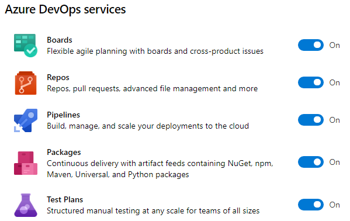
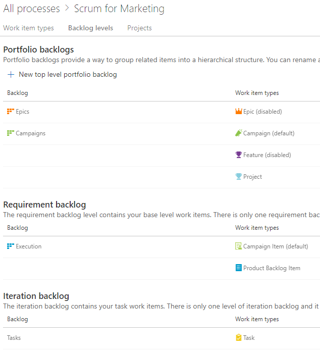
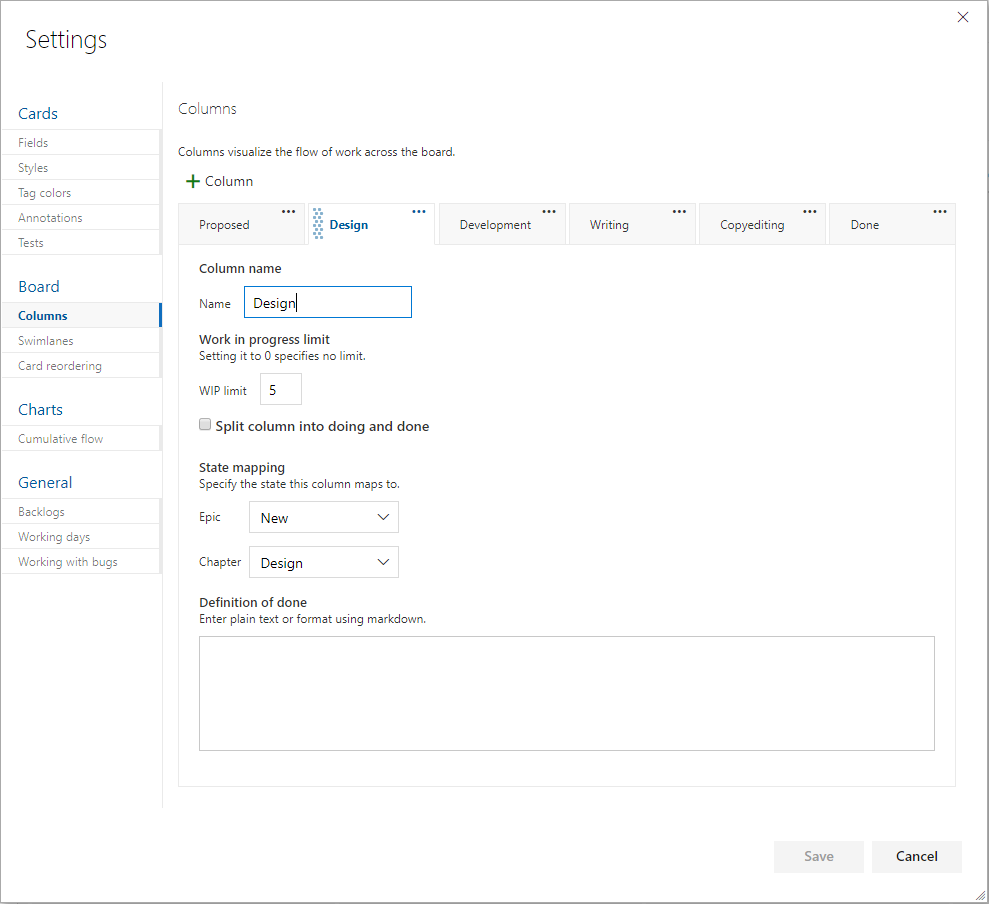

Configuring Azure DevOps for the Professional DevOps Environment
================================================================

Now that you’ve looked at the capabilities of the professional DevOps
environment and a mix of tools that can be a part of it, we’ll drill down into
each product within the Azure DevOps family and set it up in the proper way.
You’ll certainly want to customize the configuration, but your suggested
configuration works great in 80% of the cases. If you’ve already read the book
“The Phoenix Project” by Kim, Spafford, and Behr, you’ll recognize the “three
ways of DevOps” implemented as you move through this section. Once you have your
Azure DevOps project created, take a glance at your project settings and select
the products that you’d like enabled.

In **Figure 11**, you can see that for the purposes of this article, I have all
of the products enabled. For your team, you’ll want to equip them with the
Visual Studio Enterprise subscription (formerly called MSDN Premium) so that
they have licensing for all of the products. You’ll need them.

**Figure 11:** You can enable or disable any of the products in the Azure DevOps
family.

Azure Boards Makes Work Visible
-------------------------------

Within the first way of DevOps is the principle of “make work visible”. Azure
Boards is the tool of choice for modeling the shape of your work. Azure Boards
uses Work Items to track a unit of work. A work item can be of any type and has
a status as well as any number of other fields you’d like. As you think about
your hierarchy of work, don’t immediately start creating work items using the
built-in sample hierarchy. Instead, think about the work that you already do and
the parent-child relationships between some of the types of work. For example,
in a marketing department, the structure in **Figure 12** may be appropriate.

**Figure 12:** A marketing department has Campaigns that are broken down into
individual items.

This marketing department has decided that they only need three levels of work.
A Campaign can have multiple Campaign Items or Product Backlog Items. A Campaign
Item and a Product Backlog Item can have multiple Tasks. At the top level, they
can track at the Campaigns level or the Execution level. An individual iteration
or sprint is tracked with Tasks. You can have any number of higher-level
portfolio backlogs if you need higher levels of groupings. Even while the
built-in process template includes **Epic \> Feature \> Product Backlog Item**,
you’ll quickly outgrow this because it won’t match your organization. You need
to disable most of the built-in work item types and create your own so that you
can name them and put only the fields and the progression of statuses that make
sense in your teams’ environments.

You may think of the following work types to get the creative juices flowing in
order to capture the model of your organization’s world. Notice that I didn’t
say “design the model.” Your model already exists. You need to capture the nouns
and the verbs of your existing reality and make Azure Boards represent what’s
already there. If you capture the wrong model, it won’t fit, and your co-workers
will have a hard time tracking their work because it just won’t make sense. So,
consider the following types:

-   Business initiatives

-   Marketable features

-   Plannable work to budget, schedule, and fund

-   Individual tasks to get done

This becomes the foundation of your usage of Azure Boards going forward. You’d
never think of starting a new application with the Northwind or AdventureWorks
database schema. Those tables were chosen by someone else. That model just
doesn’t fit the nature of the data you’re trying to store. In this same way, the
schema of the built-in process templates won’t fit your organization. You need
to load your own model. Once you have your model, you need to specify the
process of each major entity (work item). For example, if you were writing an
article or a book, you might create a Chapter work item and specify the status
progression on the Kanban board like that shown in **Figure 13**.

**Figure 13:** The columns all map to a state of a work item, and each can be
assigned a definition of Done.

By determining ahead of time what the process is to take a certain level of work
item from creation to done, you organize your team. Each state, or board lane,
should be owned by a type of role. For example, if you have a stakeholder
designated as the person who’ll give the go ahead on the sketch of a screen
before it’s developed, that stakeholder should have a column where they own the
work within it. Each work item is represented by a visual card on the Kanban
board, and the cards in their column are theirs to work. If the stakeholder does
nothing, cards pile up in that column, and nothing is developed because of the
bottleneck in that column. A dashboard report can bring this to light on a daily
basis so that no column has too much work in it. The stakeholder’s job would be
to either approve the sketch of the screen or initiate a conversation to fix it.
In no case would you want a bad screen to be coded. That would be worse. By
creating a good number of columns, mapped to the states of the work item, you
can move the work through a known process where every column has a type of role
responsible for performing a known set of work and then forwarding the work in
process WIP to the next column. From a quality control perspective, every person
starting on work has the obligation for inspecting the WIP to see if the work is
ready for them yet. If something is missing, you stop the line and get it
corrected before propagating the error further downstream.

For the purposes of software teams, the level of backlog that is prepopulated
with Product Backlog Items in the case of the Scrum process template or User
Stories in the case of the Agile process template, is the appropriate level for
doing branches and pull requests as well as designed test cases, as you’ll see a
bit later in the article. Iterations or sprints can be planned with work items
from this level. Then, tasks can be organically created, completed or destroyed
day by day. It’s often good to make plans based on the lowest backlog level and
then break those down into tasks as needed on an ad-hoc basis during the sprint.
