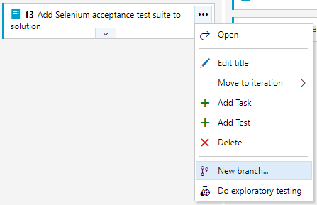
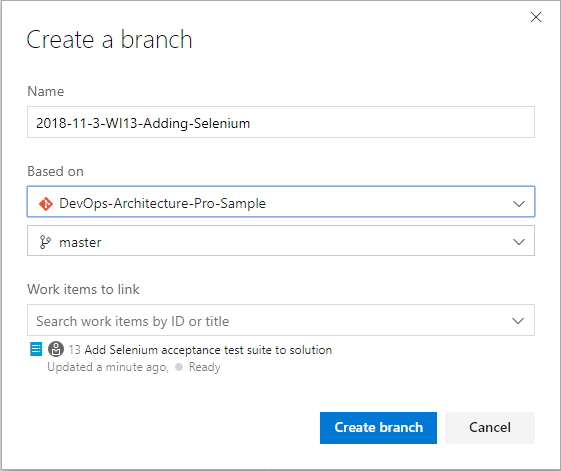
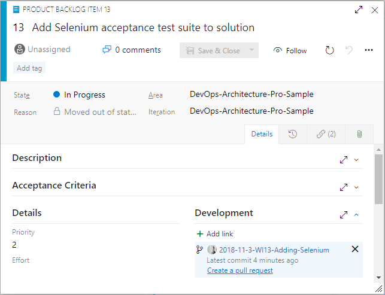
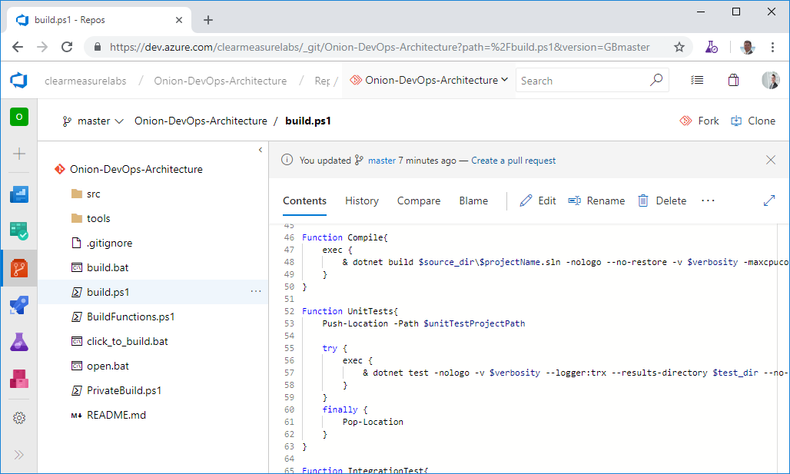

Azure Repos Tracks All the Code
-------------------------------

Azure Repos is the version control system in the Azure DevOps family. It
supports the old TFVC format of source control and also an unlimited number of
private or public Git repositories. There are import tools for migrating
existing code repositories. Azure Repos not only works with Visual Studio, but
it also works with any other Git client, such as TortoiseGit, which is one of my
favorites.

In setting up your Git repository in the professional way, there are some
principles to keep in mind. First, your team will likely have multiple
repositories, unless you ship only one product. The architecture of your
software will also have something to do with the granularity of your repository
design. For example, if you deploy your entire system together and the
architecture doesn’t support deploying only a subset of the system, it’s likely
that you will put the entire system into a single Git repository. As an
organization, you may have multiple software teams. Here are some rules of thumb
for determining repository segmentation:

-   One team can own multiple repositories, but one repository cannot be
    effectively owned by multiple teams.

-   Don’t use spaces in Azure DevOps project names. These spaces become %20 in
    the Git URL and that causes problems down the road.

-   Use one branching pattern. Branch for features off the master. Don’t attempt
    to branch only a child path.

-   When importing TFVC or Subversion, don’t maintain a structure where
    sub-repositories are designed with multiple independent applications. Break
    them apart. See the sidebar for more on this.

Some of the features of Azure Boards integrate very nicely with Azure Repos.
Branching, commit linking, and Pull Requests work very nicely and should be used
because they automate the tracking of the progress. In **Figure 14**, you can
see how quickly you can begin a Backlog Item and start a branch from the master
for work on that item.

**Figure 14:** You can create a new branch immediately after dragging the work
item into an “In Progress” state.

In **Figure 15**, you see that your branch will be linked to the work item and
initiated off master.

**Figure 15:** Choose a team naming convention for branch names, and then stick
with it.

It’s important that the team creates a naming convention for branches because
none is provided. I suggest embedding the create date somehow as well as the
work item number so that it is easy to identify when viewed in a list. Old
branches become stale and risky, so you don’t want to keep branches around for
long. Adding this information will keep that a part of the team culture.

When committing to the Git repository, add \#WINUMBER to the commit message.
This automatically links the commit with the work item. The User Story or
Product Backlog Item is the proper level to work linking commits. As a team,
agree on this level or choose another and be consistent. After the piece of work
is finished, work on this branch is done, and this branch can serve as a package
of code changes to be merged back to the master. Ideally, in the normal course
of a day, and with a team of four engineers, several branches will be created,
and several branches will be pull-requested back in. In this manner, branches
are being created and destroyed daily while the number of branches that exist on
a daily basis is always less than the number of team members.

As a team, agree on the level for linking commits. Be consistent.

The easiest way to complete a sprint work item is to initiate the pull request
from the work item itself. Even though the operation will execute within Azure
Repos, the workflow on the Kanban board is more streamlined than it is from
within your Git client, even if you’re using the Visual Studio Team Explorer
pane. **Figure 16** shows where to initiate your pull request.

**Figure 16:** On the bottom-right, you can create a pull request straight from
the work item screen.

There’s often a discussion about what to store in the application’s Git
repository. The short answer is “store everything.” Absolutes are never right.
(Except for the previous sentence.) However, you do store almost everything in
your Git repository, including:

-   Database schema migration scripts

-   Azure Resource Manager (ARM) JSON files

-   PowerShell scripts

-   Tests

-   Build scripts

-   Images

-   Content assets

-   Visio architecture blueprints

-   Documentation

-   Dependencies, including libraries and tools

Given that there are some exceptions not to store, I’ll go through a few of the
items required for developing software that you do not store in your Git
repository. You can see that the items on this list are already impractical to
store. Although it may be technically possible to store some of these items, the
pain starts to become a losing trade-off in risk.

-   Windows, the obvious one

-   Visual Studio or VSCode, even if it’s possible to run it straight from disk

-   Environment-specific data and configuration; this doesn’t belong to the
    software, it belongs to the environment

-   Secrets; they are secret, so you shouldn’t know them anyway

-   Large binary files that change very frequently, such as files from Autodesk
    products like AutoCAD and Revit

I want to address .NET Core specifically because the architecture of the .NET
Framework has some fundamental differences here. With .NET Framework
applications, the framework versions are installed on the computer as a
component of the operating system itself. So it’s obvious that you don’t check
it in. You check in only your libraries that your application depends on. If you
need 7Zip or Log4Net, you obtain those libraries and check them into your Git
repository because you depend on a particular version of them. With the advent
of package managers, the debate has raged over when to not check in packages
from npm or NuGet. That argument isn’t settled, but for .NET Framework
applications, my advice has been to check in all your dependencies, including
packages.

This fundamentally changes with the architecture of .NET Core. With .NET Core,
the framework isn’t installed as a component of the operation system. The
framework is delivered by NuGet to the computer running the build process.
Furthermore, .NET Core libraries that are packaged as NuGet components have been
elevated to framework status and are delivered in exactly the same way as .NET
Core SDK components are. Therefore, my advice for .NET Core applications is to
leave the defaults in place and do not commit the results of the dotnet.exe
restore process into your Git repository. Under active development, this mix of
SDK components and other NuGet packages will change quite a bit. Once the system
reaches maturity and the rate of change slows, it may be appropriate to move and
commit the **packages** folder in order to lock in that mix of dependencies
given that package managers do not absolutely guarantee that the same mix of
dependencies will be restored next month or next year. If you want to evaluate
this for yourself and determine your risk tolerance, you can examine the
packages easily by application by adding a Nuget.config file to your solution
with the following configuration.

\<?xml version="1.0" encoding="utf-8"?\>

\<configuration\>

\<config\>

\<add key="globalPackagesFolder"

value=".\\packages" /\>

\</config\>

\</configuration\>

Before you move on from Azure Repos, you must discuss the proper structure for a
Git repository. Although you may make a different pattern work for you, the
following generally works for most Visual Studio applications. **Figure 17**
shows the top-level folder structure of an Azure Repos Git folder structure.

**Figure 17:** The top-level of a Git repository can be quite standard
regardless of the type of Visual Studio software you’re developing.

You can see some directories and some script files at the top level. Notice that
you don’t see a Visual Studio solution at the top level. That’s intentional.
Let’s take the directories and files that you need in a properly organized Git
repository.

-   **/src/**: The application code is in this directory, beginning with the
    solution file. This is a common convention in multiple programming platforms

-   **/tools/**: Any tools needed for the build process go in this directory.
    Common needs are 7Zip, Octo.exe, etc.

-   **/build.ps1**: This is the private build script. Whether you name it this
    or not, you need your private build script in the top-level directory

-   **/click_to_build.bat**: A mouse-friendly helper that adds an “& pause” to
    the build script so that the console window remains open for the examining
    of the build output

-   **/open.bat**: A mouse-friendly helper that opens the Visual Studio solution
    via a double-click

-   **/build/**: This directory is automatically created and destroyed by the
    build script. It shouldn’t be committed to source control
