Azure Pipelines Builds and Deploys the Software
===============================================

Azure Pipelines are gaining wide adoption because of the compatibility and ease
with which an automated continuous delivery pipeline can be set up with a
software application residing anywhere. From GitHub to BitBucket to your own
private Git repository, Azure Pipelines can provide the pipeline. There are four
stages to continuous delivery, as described by the 2010 book, Continuous
Delivery. These stages are:

-   Commit

-   Automated acceptance tests

-   Manual validations

-   Release

The commit stage includes the continuous integration build. The automated
acceptance test stage includes your TDD environment with the test suites that
represent acceptance tests. The UAT environment, or whatever name you choose,
represents the deployed environment suitable for manual validations. Then, the
final release stage goes to production where your marketplace provides feedback
on the value you created for it. Let’s look at the configuration of Azure
Pipelines and see how the product supports each part of continuous delivery.

Professional Continuous Integration in the Build Hub
----------------------------------------------------

Earlier in the article, you saw how the quickstart templates didn’t provide the
needed parts of continuous integration. Let’s walk through the parts necessary
to achieve continuous integration using the Build Hub of Azure Pipelines. If
you’d like to follow along by cloning the code, please follow the link
associated with this article.

Before you even create a CI build configuration in Azure Pipelines, you must
have your private build. Attempting to create a CI build without this foundation
is a recipe for lost time and later rework. **Listing 1** shows your complete
private build script. You can see that you restore, compile, create a local
database, and run tests. The first time you clone the repository, you’ll see
quite a bit of NuGet restore activity that you won’t see on subsequent builds
because these packages are cached. **Figure 18** shows the dotnet.exe restore
output that you’ll only see the first time after clicking click_to_build.bat.

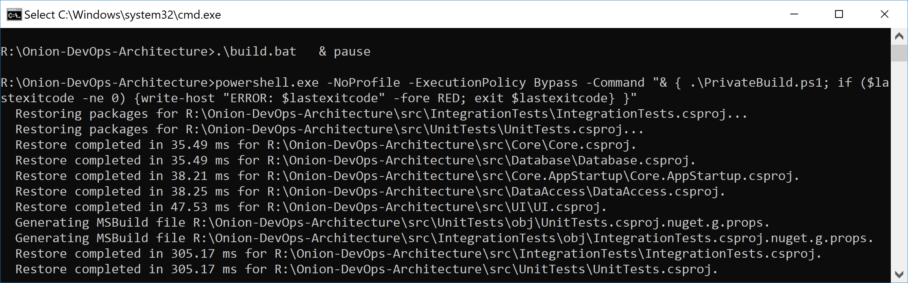

**Figure 18:** The first time the private build runs, you’ll see more output
than normal from the Restore step.

In the normal course of development, you’ll run build.ps1 over and over again to
make sure that every change you’ve made is a solid, stable step forward. You’ll
be using a local SQL Server instance, and the build script will destroy and
recreate your local database every time you run the script. Unit tests will run
against your code. Component-level integration tests will ensure that the
database schema and ORM configuration work in unison to persist and hydrate
objects in your domain model. **Figure 19** shows the full build script
executive with “quiet” verbosity level enabled.

**Figure 19:** The output from the private build can fit on one screen and run
in less than one minute.

This is a simple private build script, but it scales with you no matter how much
code you add to the solution and how many tests you add to these test suites. In
fact, this build script doesn’t have to change even as you add table after table
to your SQL Server database. This build script pattern has been tested
thoroughly over the last 13 years across multiple teams, hundreds of clients,
and a build server journey from CruiseControl.NET to Jenkins to TeamCity to VSTS
to Azure Pipelines. Although parts and bits might change a little, use this
build script to model your own. The structure is proven.

Now that you have your foundational build script, you’re ready to create your
Azure Pipeline CI build. As an overview, **Figure 20** shows the steps you use,
including pushing your release candidate packages to Azure Artifacts.

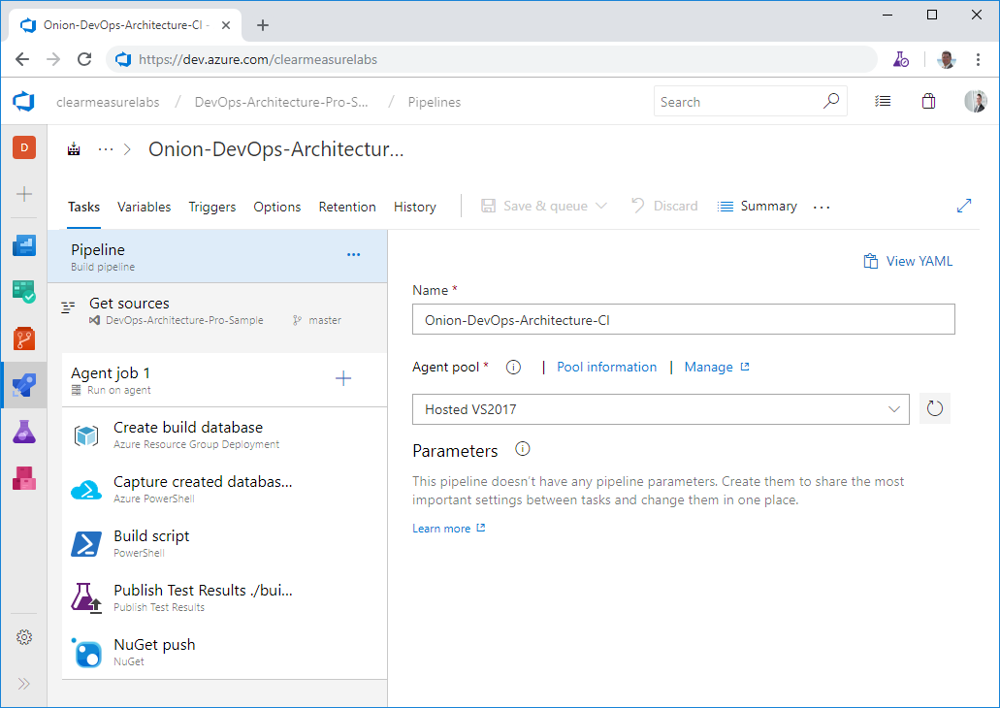

**Figure 20:** Azure Pipelines build configuration is quite simple when you
start with the foundation of a private build script.

First, I’ve left the defaults that don’t need to be customized, but let’s go
through the parts that are important. First, you’ll choose your agent pool. I’ve
chosen Hosted VS2017 because this software will be installed on the Windows
kernel, so it’s important that it be built with Windows as well. Next, I need to
set up the environment for the execution of the PowerShell build script. This
means that I need a SQL Server database. Given that the hosted build agents
don’t have a SQL Server installed on them, I’ll need to go elsewhere for it. You
can use an ARM script to provision a database in your Azure subscription so that
your integration tests have the infrastructure with which to test the data
access layer. I’ll review where these **Infrastructure as Code** assets are
stored in the section below entitled Integrating DevOps Assets. And rather than
moving through many too many screenshots and figures, I’ve exported this build
configuration to YAML, and you can see it in **Listing 2**. I’ll highlight some
of the key configuration elements that are often overlooked. After the creation
of a database that can be used by the integration tests, you want to ensure that
your compilation steps handle the versioning properly. After all, the purpose of
this build is to create a release candidate. The candidate for release must be
versioned and packaged properly and then run through a gauntlet of validations
before you would ever trust it to run in production. As you call your PowerShell
build script, you call the command with the following arguments

./build.ps1 ; CIBuild

Even though there is only one explicit parameter, all of the build variables are
available to any script as environment variables. **Figure 21** shows the
variables you have configured for this build.

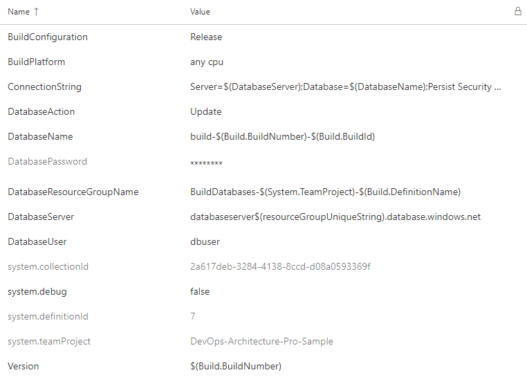

**Figure 21:** The build variables are available to the build steps as
environment variables.

Remember earlier in the article the emphasis I made on proper versioning in the
build process? If you’ll recall in the build script shown in **Listing 1**, you
arrange some PowerShell variables before you begin executing the functions. The
build configuration and version are captured here.

\$projectConfig = \$env:BuildConfiguration

\$version = \$env:Version

In this way, you can call dotnet.exe properly so that every DLL is labeled
properly. See the command line arguments used as you compile the solution.

Function Compile{

exec {

& dotnet build \$syource_dir\\\$projectName.sln

\-nologo --no-restore -v \$verbosity

\-maxcpucount --configuration \$projectConfig

\--no-incremental /p:Version=\$version

/p:Authors="Clear Measure"

/p:Product="Onion DevOps Architecture"

}

}

The build script also runs tests that output \*.trx files so that Azure
Pipelines can show and track the results of tests as they repeatedly run over
time. Finally, you push the application in its various components to Azure
Artifacts as \*.nupkg files, which are essentially \*.zip files with some
specific differences.

Besides the steps of the build configuration, there are a few other options that
should be changed from their defaults. The first is the build number. By
default, you have the date embedded as the version number. This can certainly be
the default, but to use the Semver pattern (<https://semver.org/>), you must
change the “Build number format” to the following.

1.0.\$(Rev:r).0

Additionally, as you enable continuous integration, you’re asked what branches
should be watched. The default is the master branch, but you’ll want to change
that to any branch. As you create a branch to develop a backlog item or user
story, you’ll want commits on that branch to initiate the pipeline as well. A
successful build, deployment, and the full battery of automated tests will give
you the confidence that it’s time to put in your pull request. This setting is
tricky and not quite obvious. As you click in the “Branch specification”, you’ll
type an asterisk (\*) and hit the Enter key. **Figure 22** shows what you should
see.

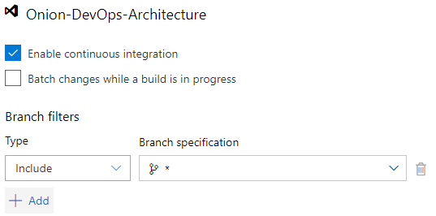

**Figure 22:** Configure the continuous integration build to trigger on commits
to every branch.

A useful dashboard widget can be the Build history widget shown in **Figure
23**.

**Figure 23:** Seeing the builds on the dashboard can alert you to increasing
build times.

This is a simple solution, but your build time is already up to four minutes and
38 seconds. Yes, your build runs in a minute locally. This is because of the
hosted build agent architecture. As soon as you have your build stable, you’ll
want to start tuning it. One of the first performance optimizations you can make
is to attach your own build agent so that you can control the processing power
as well as the levels of caching you’d like your build environment to use.
Although hosted build agents will certainly improve over time, you must use
private build agents in order to achieve the short cycle time necessary to move
quickly. And the three minutes overhead you incur just for the privilege of not
managing a VM is not a good trade-off at the moment.

Although hosted build agents will certainly improve next year, you must use
private build agents now in order to achieve a 1-2 minute CI build, complete
with database and tests.

Azure Artifacts Manages Release Candidates
------------------------------------------

Azure Artifacts is an independent product, but it’s used in conjunction with
Azure Pipelines. It’s the storage service for the release candidate components
produced by the continuous integration build. The application for this article
has three deployable components that are built and versioned together.

-   Website user interface (UI)

-   Database

-   Integration tests

The first two can be obvious, but you may be wondering about the integration
tests. This deployable package contains test data and testing scripts that are
also used to properly set up the TDD environment. You factor it into a separate
deployable component because it does need to be deployed to an environment in
your pipeline, but it’s not a part of the actual software application that will
make its way to the production environment.

Earlier, I stressed how important versioning is in a DevOps pipeline. In
**Figure 24**, you inspect the release candidate packages.

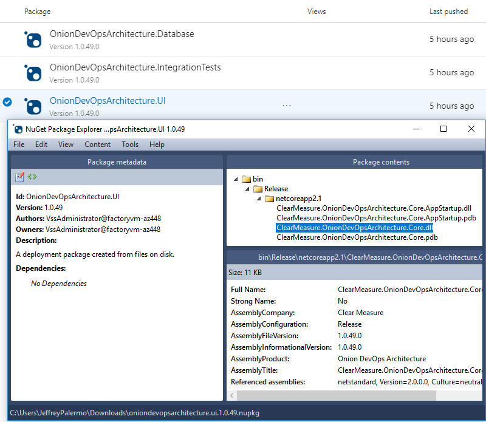

**Figure 24:** The version of the release candidate is stamped on the NuGet
packages as well as every assembly inside.

Because the proper version number is now embedded into every assembly, your code
has access to it. Whether you display it at the bottom of the screen or include
it with diagnostics telemetry or logs, you’ll use the version number to know
whether a problem or bug was on an old version or the current one. Without the
version number, you fly blind. Do not try to use date and time stamps to
decipher what build you’re working with. Explicitly push the version number into
every asset.

Don’t try to use date and time stamps to decipher what build you’re working
with. Explicitly push the version number into every asset.

Professional Automated Deployments with the Release Hub
-------------------------------------------------------

Now that you’ve properly packaged release candidates, you can use the Release
Hub of Azure Pipelines to model your environment pipeline and configure
deployments. You can define multiple deployment pipelines that use a single
build as a source of release candidates. In this example, you’re targeting Azure
PaaS services for the runtime environment of your application. As the builds are
released to your deployment pipeline, you’ll see something similar to **Figure
25**.

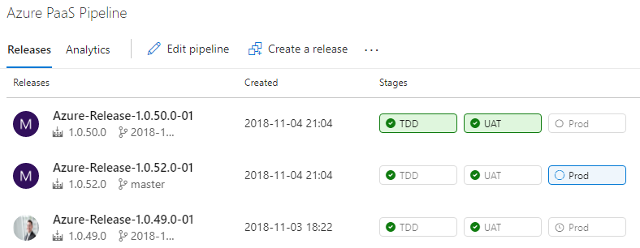

**Figure 25:** You can track each build as it’s deployed through your
environments.

Earlier in this article, I discussed the three distinct types of environments in
a DevOps pipeline. In your organization, you may need multiple instances of one
or more of the environment types, but in the application here, you have one
environment per type for demonstration purposes. **Figure 26** shows the
environments configured in series.

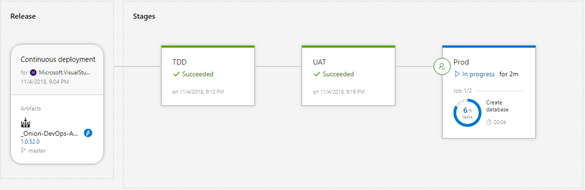

**Figure 26:** Each environment receives the same release candidate as it’s
promoted from the environment that precedes it.

The source of the release configuration is a continuous integration build. The
version number of the release inherits the build number. In most cases, you’ll
configure your environments in series, starting with the TDD environment, then
UAT, then Production. Your names may be different. The software is built and
packaged exactly once, and the release candidate, in the form of NuGet packages,
is deployed to each successive environment. Let’s see how to configure the
Release Hub.

The source of the release configuration is a continuous integration build. The
version number of the release inherits the build number

**Figure 27** shows how to enable builds to trigger a release.

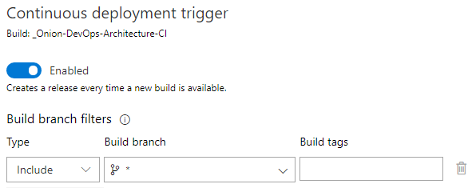

**Figure 27:** Configure the trigger in release artifacts to include builds from
every branch.

It is important to configure the Build branch for every branch. If you don’t,
your feature branch builds won’t trigger a release, and you won’t be able to use
your full-system test suites to validate these builds before executing your pull
request.

When you edit the deployment process for an environment, you’ll want to make
sure that the steps are the same from environment to environment. The best way
to do this is to structure the deployment steps like you would a PowerShell
script. That is, you factor the steps into functions that are called Task
groups. **Figure 28** shows the deployment process for your environments.

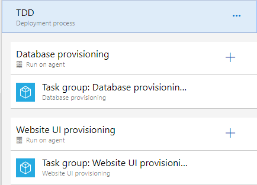

**Figure 28:** Each deployment process is essentially just a pointer to the Task
groups that are relevant for the environment.

You use task groups so that you don’t violate the DRY principle (Don’t Repeat
Yourself) when specifying what steps should happen per environment. Because you
have three environments, you don’t want to copy and paste steps across
environments.

When you look into the task groups for the deployment of each of your
application components, you see the individual steps. **Figure 29** drills down
into the individual steps needed in order to deploy the database.

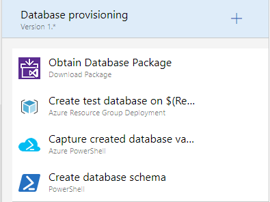

**Figure 29:** Four steps create and deploy your SQL Server database.

These same steps can run on every environment because the behavior varies by the
parameters that are passed in. For instance, in your TDD environment, you want
to destroy the database and recreate it from scratch. In the UAT and Production
environments, you want to preserve your data. A variable dictates which of these
paths is taken per environment. **Figure 30** shows the full list of variables
used by this release configuration.

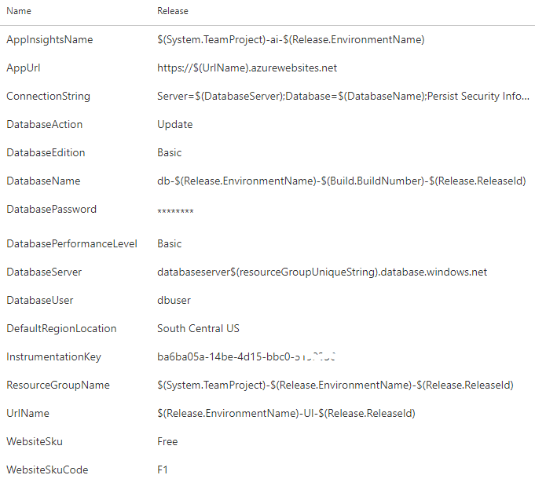

**Figure 30:** The release behavior varies by the variables that are configured.

Take a critical look at the values of the variables. This is true for the build
variables, and it’s true for release variables as well. Some of the values are
scalar values, but many of the values are templated patterns. Because you’re
going to be creating many releases, you need values that are going to be
resilient to the repetitive nature of DevOps. You also need a variable scheme
that is going to be resilient to the inherent parallelism of deploying release
candidates from multiple branches, all at the same time. Because of this
dynamic, you can’t assume that only one release will be deploying at a time.
Each of these values need to be unique, so you assemble the values based on
properties of the release itself, the environment you are deploying to, and the
component of the application being deployed. You’ll want to have a design
session with your team to determine how to dynamically build your variables.

Because you’re going to be creating many releases, you need values that are
going to be resilient to the repetitive nature of DevOps
