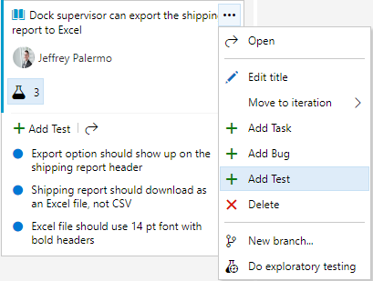
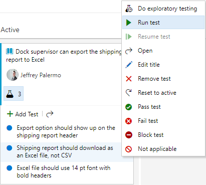
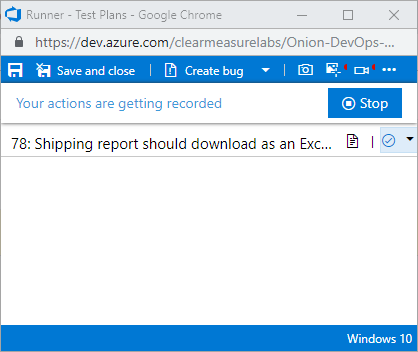
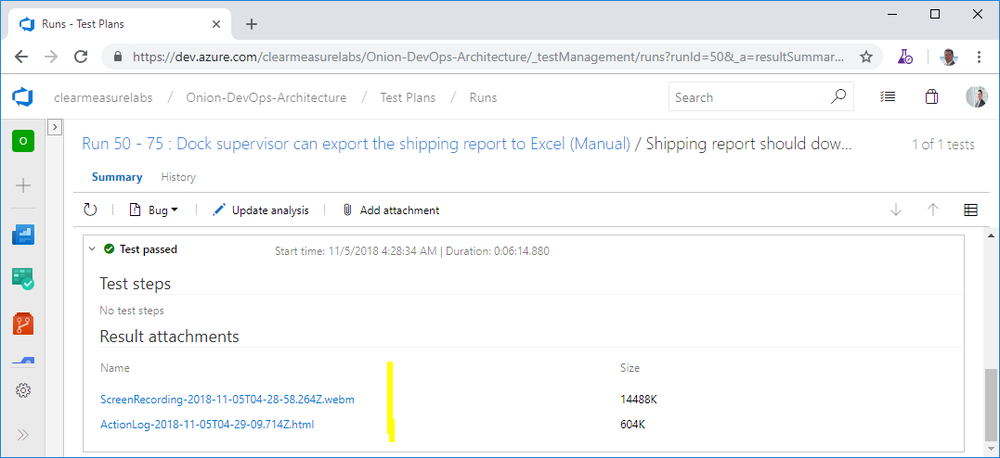
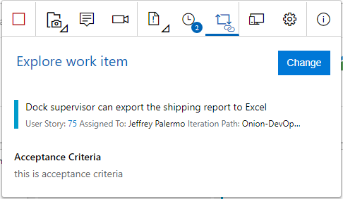

### Engage Stakeholders with Azure Test Plans

In a professional DevOps environment, you have quality control steps in every
stage. You don’t want to pass problems downstream. When it comes to manual
testing, you don’t want to leave it to the end. In his book, “Out of the
Crisis,” W. Edwards Deming writes, “quality can not be inspected into a product
or service; it must be built into it.” When you only test something after it has
been built, you’re essentially attempting to inspect what has been built and
then assume that quality will be the result. How, then, should you ensure
quality? By baking a quality control step into every stage. For example, when
defining the work, you can “test” the requirements or the concept or the idea by
specifying the steps of a functional test. This forces you to validate that you
understand what is to be built and the detailed behavior that should exist. If
you can’t specify exactly how you would test the feature before it’s built,
you’ll have discovered a defect in the description or understanding of the
feature. Proceeding on to code would be fruitless because the defect in the
requirements or analysis would then be propagated downstream. Often, the defect
is magnified by the assumptions that would have to be made in the coding
process.

In this section, you won’t cover all the capabilities of Azure Test Plans, but
you will highlight some of the universally useful capabilities. **Figure 31**
shows how you can specify the test criteria for an application feature before
the coding step.

**Figure 31:** Tests can be added to Product Backlog Items or User Stories.

The tests for the software behavior are important pieces of information. The
coding time is normally reduced when the test cases are explicitly spelled out.
And the method of attaching them to the work item keeps it very simple and fast.
There’s no need for a cumbersome test plan document when the equivalent of
bullet point items can bring clarity to the expected behavior. Additionally,
many of the specified tests likely can be codified into automated test cases, so
only a subset of the tests will have to be manually verified with every build.

In order to run these tests, you can just use another right mouse click.
**Figure 32** shows the mechanism to use to begin your manual test session.

**Figure 32:** You can run the test straight from the work item.

When you run the test, Azure Test Plans is going to pop up an additional browser
pane that aids you as you exercise the software. **Figure 33** shows the Test
Plans Runner.

**Figure 33:** The Test Plans Runner allows the capturing of the screen as you
test.

Notice the red indicator in the top right of the pane. I’ve selected both the
video camera and the screenshot icons and enabled them. These toolbar items
enable screen recording and the capturing of user actions, respectively. As I’m
testing the application, Azure Test Plans is recording the screen and taking a
screenshot of the area around my mouse any time I perform a click. Then, if I
find anything wrong, I can create a bug right there from the toolbar and attach
my user actions as well as a complete video of what I was doing. It even
includes an option to record audio from my microphone if I elect to narrate my
actions. This can be used to record a demo of a feature or for a stakeholder to
report exactly the experience they are seeing. **Figure 34** shows the test
session automatically recorded.

**Figure 34:** The screen recording and user action log are automatically
attached to the test run.

Regardless of whether or not the stakeholder records a bug, the capture of the
screen and actions is recorded in Azure Test Plans. If this is habitually done,
stakeholders have a very easy time providing feedback. When they encounter a
bug, they don’t have to go back and reproduce it. All they have to do is log it,
and the reproduction steps have already been captured. The stakeholder doesn’t
even have to remember what he was doing.

Another option exists for exploratory testing of software application. This is
done through the Test & Feedback tool, which is a Google Chrome or FireFox
extension. You can install it for yourself at
[https://marketplace.visualstudio.com/items?itemName=ms.vss-exploratorytesting-youb](https://marketplace.visualstudio.com/items?itemName=ms.vss-exploratorytesting-web).
Once you connect it to your Azure DevOps organization, you can click the “play”
icon and start capturing your exploratory testing session. Your stakeholders
should do this when they begin running the software through its paces. **Figure
35** illustrates how to specify the work item that is being reviewed.

**Figure 35:** Stakeholders can review any work item and provide feedback
seamlessly.

Just as in the previous workflow, a full audio and video capture runs seamlessly
as the stakeholder narrates what he’s doing as he moves through the application.
This is especially useful to capture subjective feedback and observe the user
experience even in the absence of feedback. You may have ideas on how to
streamline the experience of some features just by seeing the sequence of clicks
and types that a stakeholder uses in order to perform a transaction. As your
stakeholders adopt the Test & Feedback tool, encourage them to use the
journaling feature to write any notes that come to mind. All of this is
seamlessly captured by Azure Test Plans.
